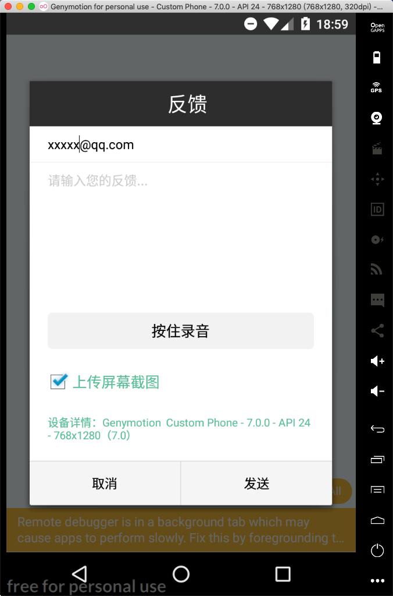
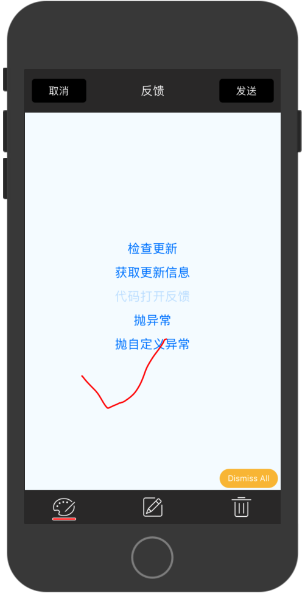
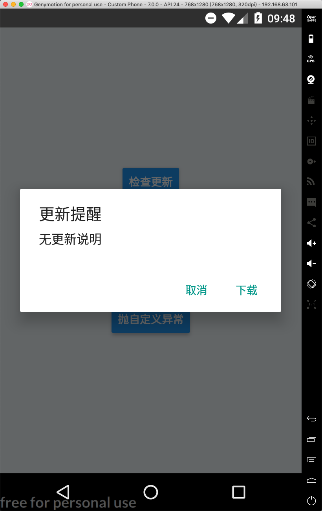
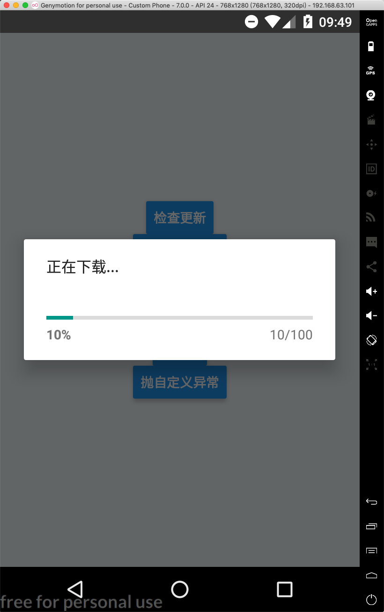
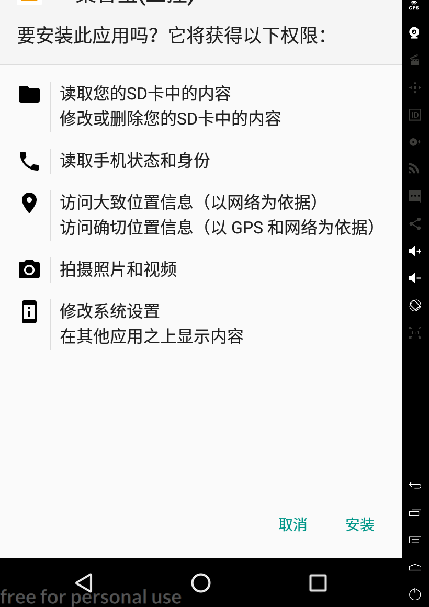
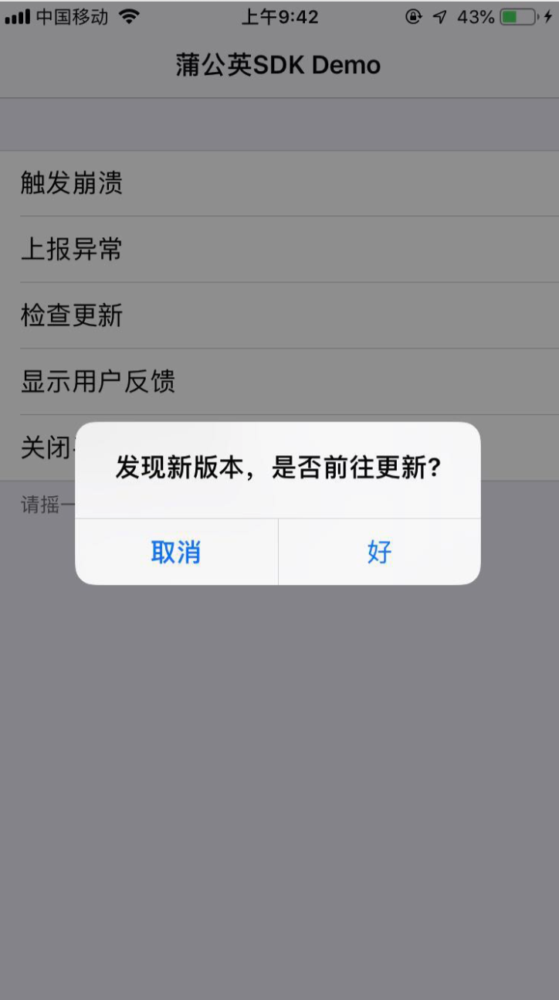
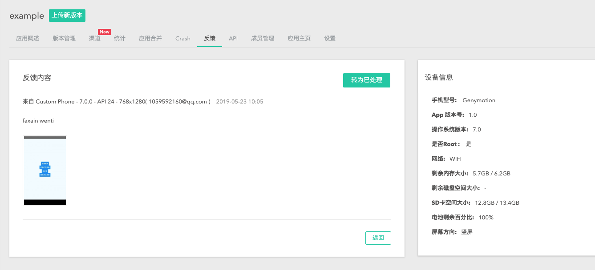
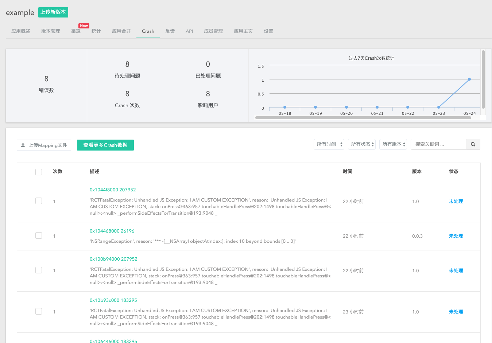

# react-native-pgyer-bridge

## 介绍


桥接[蒲公英](!https://www.pgyer.com/doc)的sdk,以便使用蒲公英的更新检查，bug反馈，异常检测功能，可以直接在蒲公英应用管理端查看。对于公司没有详细测试流程的可以接入。

## 使用场景
- 测试人员可以摇一摇反馈bug


- 检查更新,有更新就会自动安装




- 后台查看


## Getting started

`$ npm install react-native-pgyer-bridge --save` or `$ yarn add react-native-pgyer-bridge`

### Mostly automatic installation

`$ react-native link react-native-pgyer-bridge`

### Manual installation


#### iOS

1. In XCode, in the project navigator, right click `Libraries` ➜ `Add Files to [your project's name]`
2. Go to `node_modules` ➜ `react-native-pgyer-bridge` and add `RNPgyerBridge.xcodeproj`
3. In XCode, in the project navigator, select your project. Add `libRNPgyerBridge.a` to your project's `Build Phases` ➜ `Link Binary With Libraries`
4. Run your project (`Cmd+R`)<

#### Android

1. Open up `android/app/src/main/java/[...]/MainActivity.java`
  - Add `import com.reactlibrary.RNPgyerBridgePackage;` to the imports at the top of the file
  - Add `new RNPgyerBridgePackage()` to the list returned by the `getPackages()` method
2. Append the following lines to `android/settings.gradle`:
  	```
  	include ':react-native-pgyer-bridge'
  	project(':react-native-pgyer-bridge').projectDir = new File(rootProject.projectDir, 	'../node_modules/react-native-pgyer-bridge/android')
  	```
3. Insert the following lines inside the dependencies block in `android/app/build.gradle`:
  	```
      compile project(':react-native-pgyer-bridge')
  	```
### 配置项
 - ios 切换到 Build Phases选项卡中，在 Link Binary With Libraries 中添加如下六个系统 framework
 ```xml
CoreTelephony.framework
OpenGLES.framework
CoreMotion.framework
AudioToolbox.framework
AvFoundation.framework
SystemConfiguration.framework
```
 - 安卓配置 AndroidManifest
 ```xml
<!-- 必选-->
<uses-permission android:name="android.permission.ACCESS_NETWORK_STATE" /> <!-- 获取网络状态 -->
<uses-permission android:name="android.permission.INTERNET" /> <!-- 网络通信-->
<uses-permission android:name="android.permission.READ_PHONE_STATE" />  <!-- 获取设备信息 -->
<uses-permission android:name="android.permission.ACCESS_WIFI_STATE" /> <!-- 获取MAC地址-->
<uses-permission android:name="android.permission.WRITE_EXTERNAL_STORAGE" /> <!-- 读写sdcard，storage等等 -->
<uses-permission android:name="android.permission.RECORD_AUDIO" /> <!-- 允许程序录制音频 -->
<uses-permission android:name="android.permission.GET_TASKS"/>
<!-- Android8.0 安装 apk 需要添加权限-->
<uses-permission android:name="android.permission.REQUEST_INSTALL_PACKAGES" />

<!-- 可选-->
<uses-permission android:name="android.permission.READ_LOGS" /> <!-- 获取logcat日志 -->

<application
    android:allowBackup="true"
    android:icon="@drawable/ic_launcher"
    android:label="@string/app_name"
    android:theme="@style/AppTheme"
    android:networkSecurityConfig="@xml/network_security_config">
<!-- 可选-->
        <activity android:name="com.pgyersdk.feedback.FeedbackActivity"/>
<!-- Jar 包集成的方式 必填 -->
    <provider
            android:name="com.pgyersdk.PgyerProvider"
            android:authorities="${applicationId}.com.pgyer.provider"
            android:exported="false"/>
<!-- 必填 -->
    <meta-data
        android:name="PGYER_APPID"
        android:value="4b6e8877dfcc2462bedb37dcf66b6d87" >
    </meta-data>
</application>


// Android9.0 需要配置允许 SDK http请求配置：
// network_security_config.xml 文件

<?xml version="1.0" encoding="utf-8"?>
<network-security-config>
    <domain-config cleartextTrafficPermitted="true">
        <domain includeSubdomains="true">www.pgyer.com</domain>
        <domain includeSubdomains="true">app-global.pgyer.com</domain>
    </domain-config>
</network-security-config>


```
## Usage
```javascript
import Pgyer from 'react-native-pgyer-bridge';
//在入口处初始化蒲公英，appId为蒲公英上传安装包后应用的appKey
Pyger.initWithConfig({appId:'xxx'});
//简单的检查更新
Pyger.checkUpdate();
//截图并且显示反馈弹窗
Pyger.showFeedbackView();
//获取更新信息
Pyger.getUpdateInfo();
//自动发送错误日志,ios官方sdkapi有问题,安卓有效
Pyger.reportException({
              name: 'MY IS CUSTOM EXCEPTION',
              reason: "CUSTOM",
              userInfo: {
                aa: "21321",
                bb: "sadsad",
                cc: {aa: 'SAD21321321'}
              }
            })
//更多详细的用法可以看example

```
